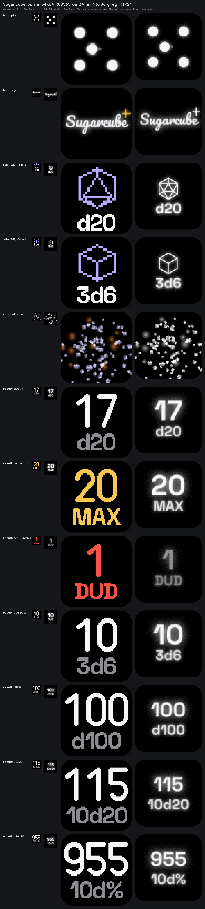

# 30 mm die: 64×64 colour proof of concept

Branch `poc/30mm-64-colour`. A 30 mm die with six 0.6" 64×64 RGB PMOLEDs (SSD1357, Newhaven NHD-0.6-6464G class) instead of the 34 mm die's six 96×96 grey SSD1317s. The firmware builds for either die from one codebase. The simulator runs either one, and the 34 mm die is unchanged: its 35 snapshot sheets regenerate byte for byte.



Contact sheets: [page 1](contact-sheet-1.png), [page 2](contact-sheet-2.png). On each row:

- the 64×64 screen at 1:1 and at 8×,
- its 96×96 counterpart at 1:1 and at 5× (the same shown size),
- the glass's rounded corners shaded on the enlarged tiles.

Every tile is drawn by the firmware's own code. The mid-throw row comes from the whole firmware running a throw on each target.

## How it's built

**Display target** (`packages/firmware/hal/src/target.rs`). `Grey96` (`TARGET_34_GREY96`) and `Rgb64` (`TARGET_30_RGB64`) each fix:

- the panel size,
- the pixel type (8-bit grey or `Rgb565`) and the packed frame,
- the die and lit-area size,
- the mask radius.

The drawing layer is generic over the target. `Framebuffer`, `Layer`, `Painter` and `Transform` carry its size and scale. `Style` holds a 24-bit colour, which grey reduces to its brightest channel (as the mockup's quantiser does) and RGB565 to its top bits. A board image is monomorphised for one target, and the simulator builds both.

**Per-target screens** (`packages/firmware/core/src/target.rs`). `DisplayTarget` adds three things:

- packing and delivery,
- the particle tints,
- hooks for the screens that have a 64×64 layout.

Screen code has no target checks.

**The 64×64 UI** (`screens64.rs`, `font64.rs`, `numerals64.rs`, `sprites64.rs`, `palette64.rs`):

- **Text.** 5×7 hand-drawn text is the **minimum readable size**: anything a player has to read is set in it. 3×5 tags are used only for things also said another way (the face number, `MAX`/`DUD` beside a coloured number, the status bar).
- **Numerals.** One condensed bold design for the result, in three sizes:
  - 44 px for 1–2 digits,
  - 30 px for 3,
  - 22 px for 4.

  Stems are whole pixels (6, 4 and 3 px), and every digit in a size is the same width.
- **Sprites.** Pixel art is hand-placed and kept as text in the source; tests check that the die icons are symmetric.
- **Colour carries meaning** (one file, `palette64.rs`):

  | Colour | Means |
  |---|---|
  | gold | max |
  | red | fumble and low battery |
  | violet | the die and the menu's arrows |
  | mint | charging, saved, a + modifier |
  | ember | embers, a − modifier |
  | grey | secondary text |

- **Screens with a 64×64 design:**
  - boot and logo,
  - idle (die icon, setup and face number),
  - roll animation (violet sugar, orange embers, gold sparks),
  - result, including max, fumble, pools, d100 and 10d100,
  - the whole menu, including the die picker,
  - saved,
  - a modifier screen (`1d20 + 5 = 17`) and a wrapped text block,
  - charging and low battery.
- **Fallback screens.** Pig Toss, Hot Potato, Pass the Pot's bills and the Nest's clock and guidance still use the 96×96 layout drawn through the 64×64 transform. It works, but it's the "shrunk 96" look, and those screens need their own 64×64 design.

**What fits.** Tests walk every case:

- every die and count's total and label,
- every menu title, value and setting.

These needed 64-only copy:
- "How many dice" became "How many", and "Bills in hand" became "Bills".
- The Settings item "Sleep after" became "Sleep".
- "Scores won't be kept" became "Scores are lost", which fits in two lines instead of three.

A text block holds 6 lines of about 10 characters (the demo sentence, "Hold a face for the menu. Tip to pick, hold to save.", is about the limit).

## Findings

**SPI is the real limit, not RAM.**
- The SSD1357's 4-wire SPI needs t_cycle ≥ 100 ns, so SCLK ≤ 10 MHz (datasheet Rev 1.0, Table 9-4). One 8 KB frame then takes about 6.6 ms, so six faces take about 40 ms: whole frames on one bus top out near 25 fps.
- The 64×64 target therefore sends only the 8×8 tiles that changed (hashed, 256 B a face), as one address window a face. It works within a byte budget each tick, sends the face-down screen last, and sends it at most every 250 ms.
- With two buses (an **estimate**; there's no 30 mm board yet) the budget is 35.4 KB a tick at 60 Hz:
  - Still screens send nothing.
  - A throw's sugar cloud fills the budget (4.6 MB over 4 s in the simulator), so each face then updates at roughly 50 fps rather than 60.
  - On one bus it would be about half that.

**RAM is fine.**
- Six RGB565 framebuffers take 48 KB, against 54 KB for six grey ones, and the drawing layer is 12 KB instead of 27 KB.
- The firmware's static state measures 100,200 B on the 30 mm image against 116,584 B on the 34 mm one.
- The app core has 188 KB; the 34 mm image used 87% of it.

**The panel is small for text.** At 0.168 mm a pixel, a 5×7 capital is about 1.2 mm tall. Results, the die picker and short labels read well. Anything sentence-like needs two to six lines, and the 96×96 die's anti-aliased type doesn't survive being scaled down, which is why the 64×64 screens use bitmap fonts.

## Building and running

```sh
cargo fw                       # 34 mm image (96×96 grey), as before
cargo fw30                     # 30 mm image (64×64 RGB): --features target-30-rgb64
cargo sim -- --die 30          # simulator on the 30 mm die (or SMOKEBOMB_DIE=30)
cargo sim                      # 34 mm die; switch in the page's Die section
UPDATE_SNAPSHOTS=1 cargo test -p smokebomb-core --test contact_sheet   # regenerate the sheets
```

In the simulator's Die section:
- **Switch die** reboots the firmware built for the other panels.
- **Close-up** moves the camera to 0.4 of its distance.
- **True size** shows the die at its real size on your screen, measured at the die's centre. Calibrate it once by matching the outline to a bank card held against the screen; the scale is saved in the browser.
- **Pixel gaps** darkens the gaps between panel pixels.

The 30 mm geometry follows the mockup's 30 mm option:
- 30 mm body, 2.5 mm edges,
- a 17.5 mm window (r 1.84) and a 10.75 mm lit area,
- four plain single-slot screws at ±10.625 mm with unaligned slots,
- the etching centred in the 8.75–12.5 mm band.

## Stubbed, estimated, and still needed

| What | State | Needs |
|---|---|---|
| SSD1357 command set, power sequence, timing | **From the datasheet** (Solomon Systech SSD1357 Rev 1.0 and its command table), cited by page in `hal/nrf54l15/src/ssd1357.rs`; tested by recording the bus | — |
| Which 64 of the SSD1357's 128 SEG/COM lines the module uses (column/row offsets), remap bits (colour order, scan direction, COM split), MUX, VCC, pre-charge, phase timing, contrast/white balance | **Placeholders, marked `MODULE TODO`** (mostly the controller's reset values) | The NHD-0.6-6464G datasheet |
| RGB565 byte order and which sub-pixel is red | High byte first per Table 6-7; red as colour C is **assumed** | The module datasheet, then the panel |
| Lit area 10.75 mm, mask radius ≈10.7 px, window 17.5 mm r 1.84 | **Estimates** from the brief and mockup | The module drawing |
| SPI buses on the board (2), bus efficiency (85 %) | **Estimates** | A 30 mm board |
| The board's SPI bus (`ZephyrPanels`) | **Stub**, like the crate's other drivers | Pins, SPIM instance, VCC enable |
| Palette | Design values | Tuning on a real panel |
| Pig Toss, Hot Potato, Pass the Pot bills, Nest clock and guidance at 64×64 | **96×96 fallback** | A 64×64 design |
| Modifier screen | Drawn and on the contact sheet; **not reachable** on the die (the firmware has no modifiers) | A modifier feature |
| Motion of a smaller die | The simulator's world model has no size or mass: both dice tumble alike | Only if rolling feel matters |
