# GBC cube: Pokémon Crystal wrapped round the die

A for-fun side experiment, **not a product feature**. A Game Boy Color
emulator runs on the 30 mm Sugarcube (64×64 colour faces), and the
overworld is draped over the cube:

- the player stands at the centre of whichever face is up;
- the map carries on over the edges onto the four side faces;
- tilting the cube walks;
- rolling it onto another face rolls the map with it, so north stays north.

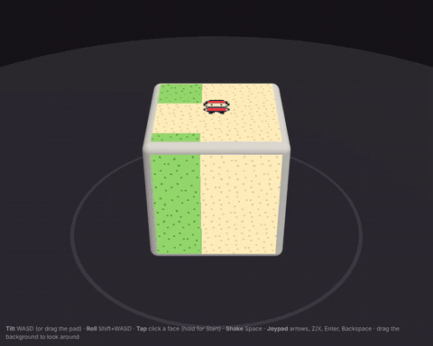

*The demo cart in the browser simulator: walking north, rolled east
mid-walk, still walking, rolled north. [Full recording](docs/cube-walk.mp4).*

It lives entirely in `experiments/gbc-cube`:

- It's its own Cargo workspace, and the repo's root workspace excludes it.
- No product crate depends on it, and CI doesn't build it.
- It borrows two product crates by path: `smokebomb-hal` for the face and
  pixel types and `smokebomb-core` for the faces' drawing axes and the
  gravity filter. That way its geometry is the firmware's.

**No ROMs in the repo.** `*.gb`, `*.gbc` and `*.sav` are git-ignored. Point
it at your own dump of Pokémon Crystal. Without one it runs the built-in
demo cart.

Hardware: [GBC_CUBE_HW_FEASIBILITY.md](GBC_CUBE_HW_FEASIBILITY.md). Verdict:
runs with frameskip, faces at 30 fps.

## Run it

```sh
cd experiments/gbc-cube
(cd web && npm install && npm run build)    # the browser page, once
cargo run --release -p gbc-cube-sim -- serve # http://localhost:3100, demo cart
```

With your ROM:

```sh
GBC_CUBE_ROM=/path/to/crystal.gbc cargo run --release -p gbc-cube-sim -- serve
# or: ... -- serve --rom /path/to/crystal.gbc
```

The battery save is read from and written next to the ROM
(`crystal.gbc` → `crystal.sav`), within a second of the game writing it. Crystal keeps its clock in the cartridge's RTC, so the save
ends with a 24-byte footer holding the clock and the time it was written.
On the next start the clock moves on by the time that passed. Other
emulators ignore the extra bytes.

### On the phone: the app's Simulator tab

The iOS app's Simulator tab can run a game on its die instead of the die
firmware. It's off by default, and builds without it (CI, release) don't
include any of it.

1. In `packages/mobile/iosApp/Local.xcconfig` (git-ignored; copy
   `Local.xcconfig.example`), add `SUGARCUBE_GBC_CUBE = YES`.
2. `cd packages/mobile/iosApp && xcodegen generate`, then build and run as
   usual. `scripts/build_firmware.sh` then builds `ffi/` here
   (`libgbc_cube_ffi.a`). It carries the die firmware too, so the app still
   links one Rust library.
3. In the Simulator tab, on the 30 mm die, tap **Game Boy** (top right) →
   **Load ROM…** and pick your ROM in Files (Downloads works).
   - The app copies it to its Documents/ROMs folder and keeps the `.sav`
     next to it there.
   - **Demo cart** needs no ROM. **Die firmware** goes back to normal.
4. Play:
   - **Walk** by leaning the die with a two-finger drag. A lean stays where
     you leave it, so the player keeps walking; drag back to the middle to
     stop. The lean goes up to about 26°, inside the cube's 12–40° walking
     range.
   - **Roll** onto another face by dragging further (about 140 points): the
     die tips past 40°, where walking stops, rolls over, and the map rolls
     with it.
   - Tapping the up face is A (also while it leans), a side face is B, and
     holding the up face is Start.
   - Throwing the die lands it on a random face; the map follows.
   - The on-screen joypad presses buttons directly, for single steps and
     menus.

Other commands:

```sh
cargo run --release -p gbc-cube-sim -- shots --out shots      # PNGs of the faces (see docs/net)
cargo run --release -p gbc-cube-sim -- bench --rom X.gbc      # host timings + ROM bank profile
cargo run --release -p gbc-cube-sim -- snapshot --out snap    # demo RAM for m33bench
cargo test                                                    # everything, incl. the PPU check
node tools/record.mjs out/   # scripted browser run: screenshots + video (needs `serve` and Playwright)
```

`m33bench/` is the Cortex-M33 benchmark (QEMU, see the feasibility report).
`tools/gen_syms.py` regenerates the Crystal symbol table from pret's `.sym`
files.

### Controls

| On the cube | Keyboard in the simulator | Joypad |
|---|---|---|
| Tilt (past a 12° deadzone, held 120 ms; up to 40°) | WASD, or drag the tilt pad | D-pad, toward the edge that dips |
| Tap the up face | click it | A |
| Tap a side face | click it | B |
| Long-press the up face (650 ms) | hold the click | Start |
| Shake | Space, or the Shake button | Select |
| Roll onto another face (tilt past 55° and settle) | Shift+WASD, or the Roll buttons | none (the map turns with it) |
| | arrows, Z, X, Enter, Backspace | the joypad directly |

Every threshold is in `core/src/controls.rs` (`ControlConfig`) and
`core/src/orient.rs` (`UpConfig`). The main ones are also sliders on the
page. Dragging the background orbits the view.

## How it works

```text
emu/     walnut-cgb (C, vendored) behind a safe Rust API       (std)
core/    cube geometry, Crystal renderer, fallbacks, controls   (no_std, no alloc)
demo/    a stand-in cart that plays Crystal's part              (std)
sim/     server, benchmark, screenshots                         (std)
web/     three.js page
m33bench/ the same C and core code on a Cortex-M33 under QEMU
```

The page owns the cube's pose. It sends what the die would sense: the
accelerometer in die axes, and which faces are touched. The server feeds
that to the core exactly as firmware would. It then runs one emulator
frame, renders six 64×64 RGB565 faces in each face's drawing axes and
streams them back.

### Phase 1: the emulator

**walnut-cgb** ([Mr-PauI/walnut-cgb](https://github.com/Mr-PauI/walnut-cgb)
under the MIT licence, vendored unmodified in `emu/vendor`):

- It's a single-header C core forked from Peanut-GB, with real CGB support:
  double speed, VRAM/WRAM banking, HDMA and CGB palettes.
- It supports MBC3 with an RTC, which Crystal needs.
- All its state is one struct of about 50 KB, with no allocation.
- It reads ROM through callbacks, the hook an external-flash bank cache on
  the die needs.
- It already runs CGB games on an ESP32-S3.

The alternatives:

- **SameBoy** (MIT): the most accurate, but its cycle-accurate PPU and size
  are far beyond a 128 MHz M33.
- **Gambatte**: accurate too, but it's GPLv2 and C++.
- **Peanut-GB upstream**: CGB support is only preliminary.
- **Rust cores on crates.io**: the ones with CGB support are `std`
  desktop emulators, not built for a small footprint.

walnut-cgb renders a line at a time, so mid-line effects aren't exact.
Crystal doesn't depend on them.

`emu/csrc/shim.c` gives Rust a stable C ABI:

- The frame comes out as RGB565 and as palette indexes.
- WRAM, VRAM, OAM, I/O and palette RAM are exposed.
- Joypad, RTC, cart RAM, and ROM read and bank-switch statistics.
- walnut's error callback must not return, so the shim unwinds with
  `longjmp`.

The core passes blargg's `cpu_instrs`: tests 01–09 show "ok" on the frame
captured at frame 900, with test 10 still running. It runs about 40× faster
than real time on one host core.

### Phase 2: the frame, folded over the cube

`core/src/geom.rs` works out, from gravity, which face is up and which way
map north points, and then where each face's pixels fall on the draped map.

- The up face shows the 64×64 around the player.
- Each side face shows what lies beyond the up face's edge on its side,
  upright as seen from that side, so its top row continues the up face's
  edge row.
- A test checks this for all 24 orientations: every pair of pixels that
  touch across an up-face edge map to neighbouring map pixels.
- The vertical edges between side faces don't join up: the map's corner
  wedges are missing, as with any cloth draped over a box.

**Where the player is.** The player's sprite is read from Crystal's own
player object struct every frame.

- From the disassembly: `InitXCoord`/`InitYCoord` put the player at
  (object − `wXCoord`) × 16 = 64, 64, and `.InitSprite` draws the sprite
  4 px higher.
- So the sprite is at (64, 60) and its ground cell at (64–80, 64–80).
- The up face centres on the cell, at frame (72, 72). The frame then
  reaches **40 px left, 56 px right and 40 px up and down** past the up
  face. That's not the 48/48 a centred guess gives.

Other games use the same spot (`Config::default_centre`).

**Rolling.** When the up face changes, north is carried along by the same
quarter turn the cube made, so the map stays put in the world. Past the
frame there's a soft fog to black: a light grid at 8 px, eased, about 16 px
deep.

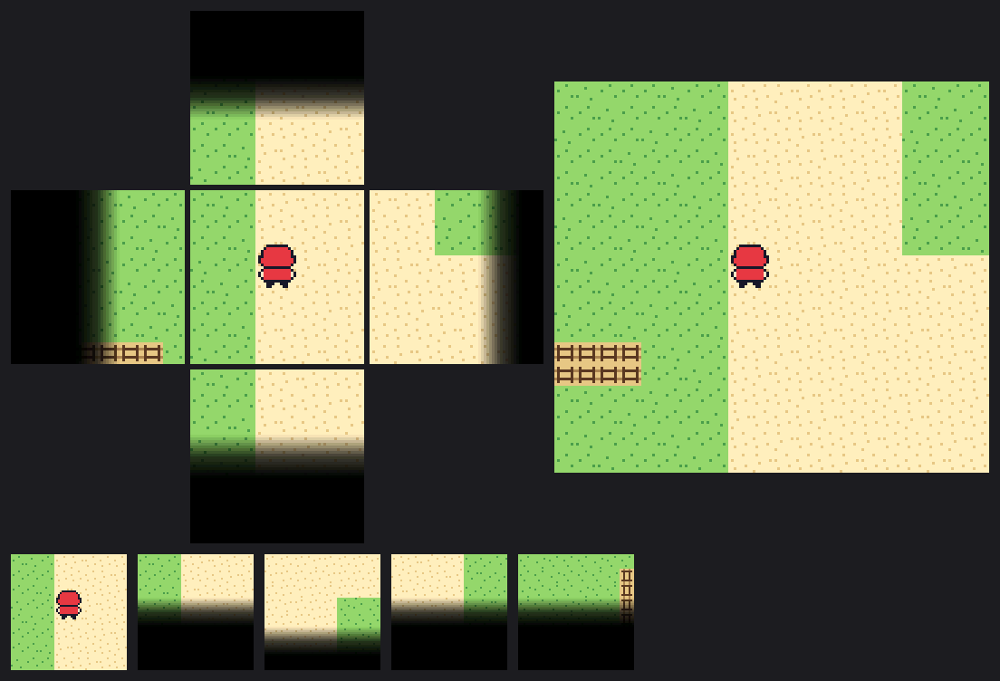

*How to read these images: on the left, the faces unfolded, the up face in
the middle and each side folded out flat. Under them, each face upright, as
a person reads it: up, front, east, back, west. On the right, the
emulator's own frame.*

### Phase 3: the world, drawn from RAM

`core/src/crystal/` redraws the overworld from game state, so every side
face shows real map. Addresses come from pret/pokecrystal's symbol files,
not hand-copied: `tools/gen_syms.py` generates them and refuses any symbol
that differs between Crystal 1.0 and 1.1.

- **Map.** `wOverworldMapBlocks` holds the current map with a 3-block border
  carrying the connected maps' strips.
  - Each block is 4×4 tile IDs, read from ROM at
    `wTilesetBlocksBank:wTilesetBlocksAddress`.
  - `LoadMetatiles`' bug, where blocks 128 and up wrap, is reproduced.
  - Each tile ID's palette and VRAM bank is a nibble of the tileset's
    palette map, in the bank of `_LoadOverworldAttrmapPals`.
  - Tile graphics come from VRAM and colours from CGB palette RAM, so
    animated water and the time of day come for free.
  - The buffer starts zeroed and only the map and its connections are
    copied in, so a 0 block means "no map here": drawn as fog, not the
    border block the game would show.
- **Camera.** At the start of a step, `UpdateOverworldMap` moves
  `wOverworldMapAnchor` and `wBGMapAnchor` a whole 16 px ahead. `hSCX`/`hSCY`
  then catch up a pixel a frame. The camera is the anchor's map position
  plus the signed distance from the scroll to the anchor's tile in the BG
  map: smooth, with no jump at the start of a step.
- **People.** The 13 object structs are turned into OAM entries the way
  `.InitSprite` does it.
  - That covers priorities, the ROM `Facings` templates (walk frames and
    flips), VRAM bank, palette, in-grass and under-tiles priority.
  - It does it for every struct, so people just off screen appear on the
    side faces.
  - Positions are 8-bit, so they're read relative to the player, taking the
    wrap the map coordinates agree with.
  - Objects go over the background with the CGB's priority rules.
- **Timing.** When a frame ends, Crystal is halted in `DelayFrame`, with
  RAM, `hSCX` and the shadow OAM already set up for the next frame.
  - The renderer draws that state, so it's one frame ahead of the emulator.
  - `wVBlankOccurred` says whether the game really was waiting. If its work
    overran the frame, the cube keeps the last picture rather than draw a
    torn one.

**Checked against the PPU.** `demo/tests/renderer_matches_ppu.rs` walks the
demo cart for about 500 frames and compares every screen pixel of the
renderer's picture with the emulator's next frame. It covers both VRAM
banks, the palette map, step scrolling, NPCs walking off screen, flips,
walk frames and priority. All match except one documented case: animated
tiles are written by the VBlank handler after the renderer has read VRAM,
so they're one frame late. The page's "Compare renderer with next frame"
does the same live: magenta pixels differ, with the count in the status.

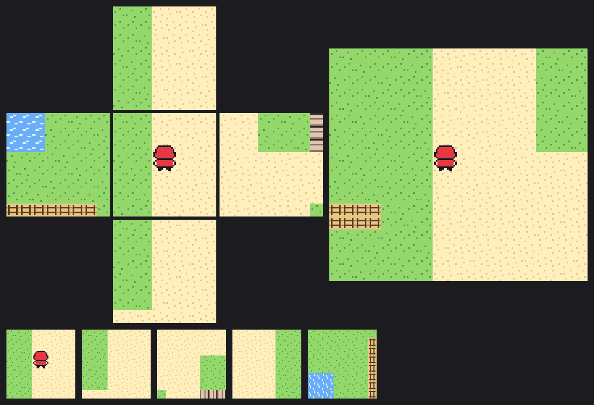
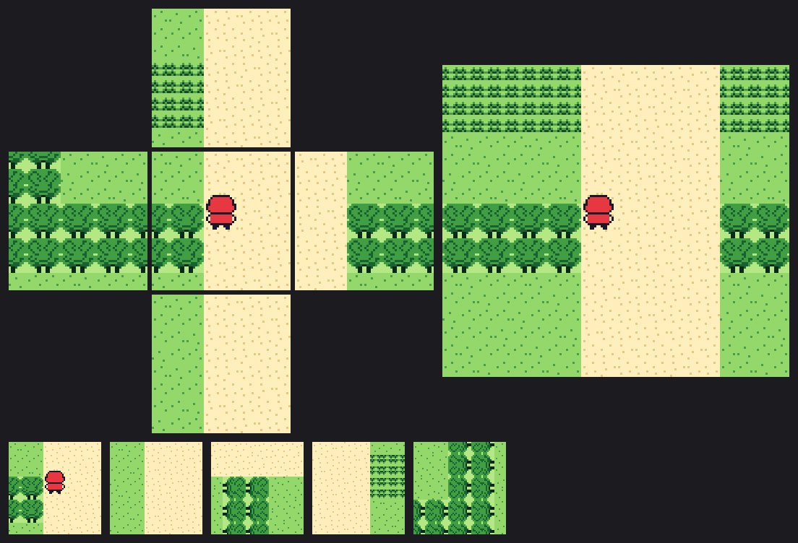
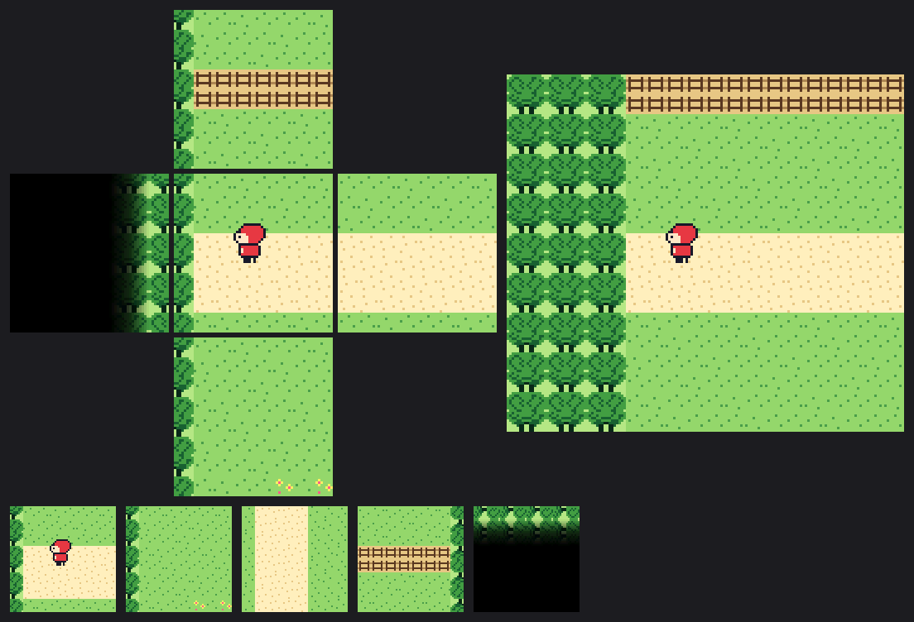

Differences from the real screen:

- Animated tiles are one frame late.
- There's no 10-objects-per-line limit.
- Fog shows where the game shows its border block.
- The window layer isn't drawn, so neither is the map name sign that pops
  up on entering an area.
- People more than about a step past the screen edge aren't in RAM at all
  (Crystal deletes their structs), so they appear only as they come close.

### Phase 4: text boxes, menus and battles

The screen is classified from `wTilemap`, which Crystal composes every
screen in before copying it to VRAM. In the overworld it holds the map's
tile IDs with bit 7 cleared, all below `$60`. Font and box-frame tiles are
`$60` and up. Comparing it with the tiles the map says should be there
answers three questions at once:

- Is the camera right? (Everything matches.)
- Where is the text or menu? (The font tiles.)
- Is this the overworld at all? (Lots of other mismatches: the bag, the
  Pokégear, the title screen.)

`wBattleMode` marks battles. Text is never scaled: it's always 8×8 glyphs
from the game's own font.

| | Text box | Start menu | Battle |
|---|---|---|---|
| **A: pan** to the active part | 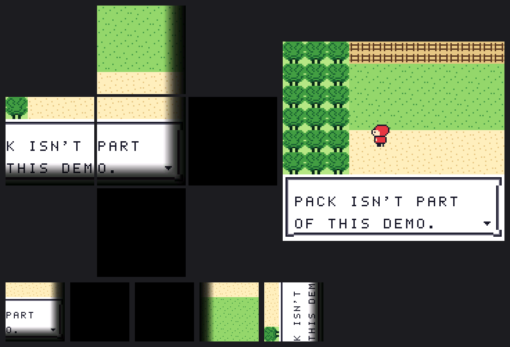 | 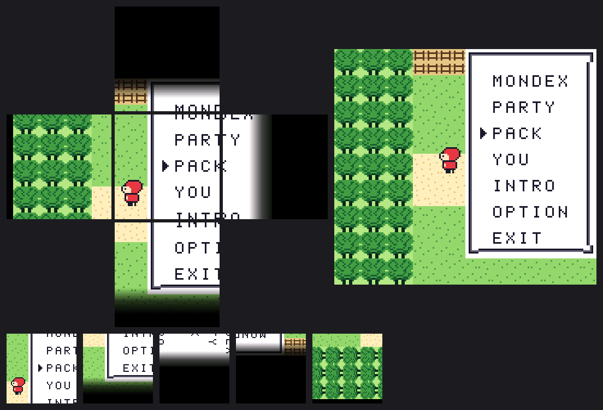 | 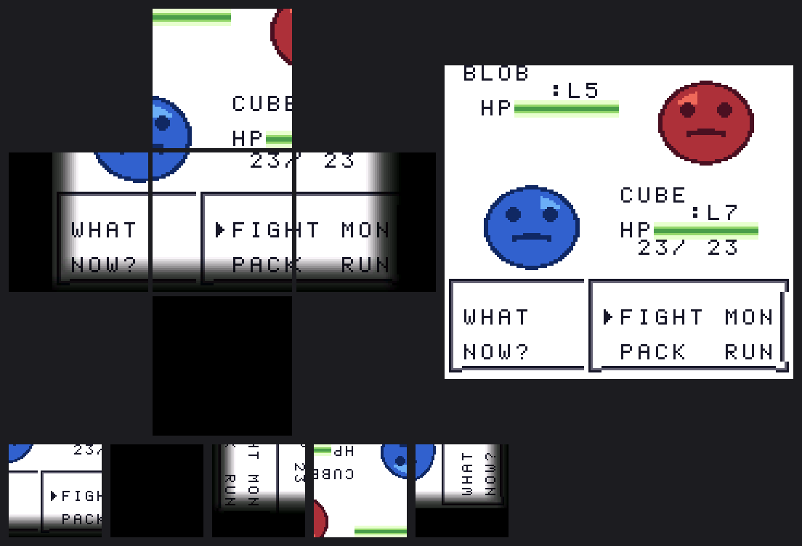 |
| **B: spread** the frame over the faces | 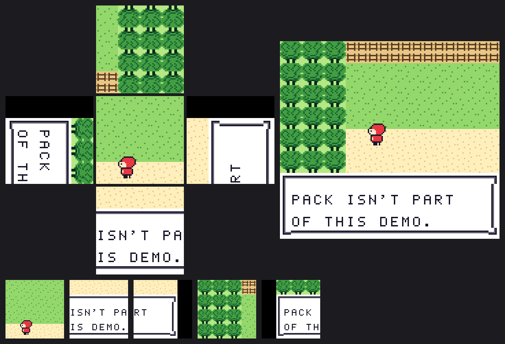 | 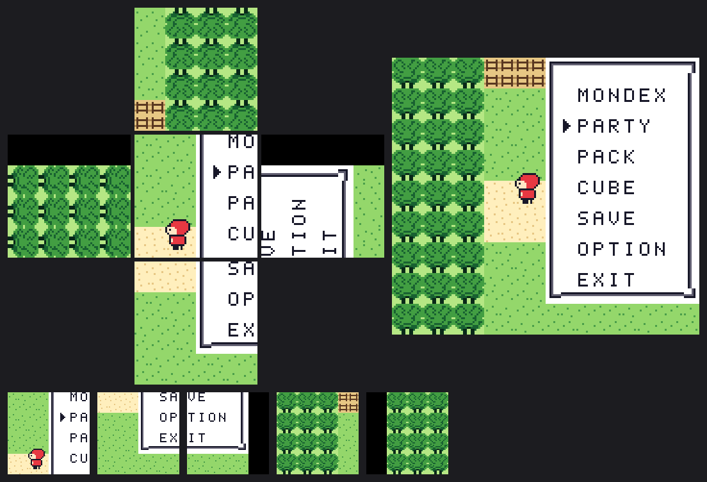 | 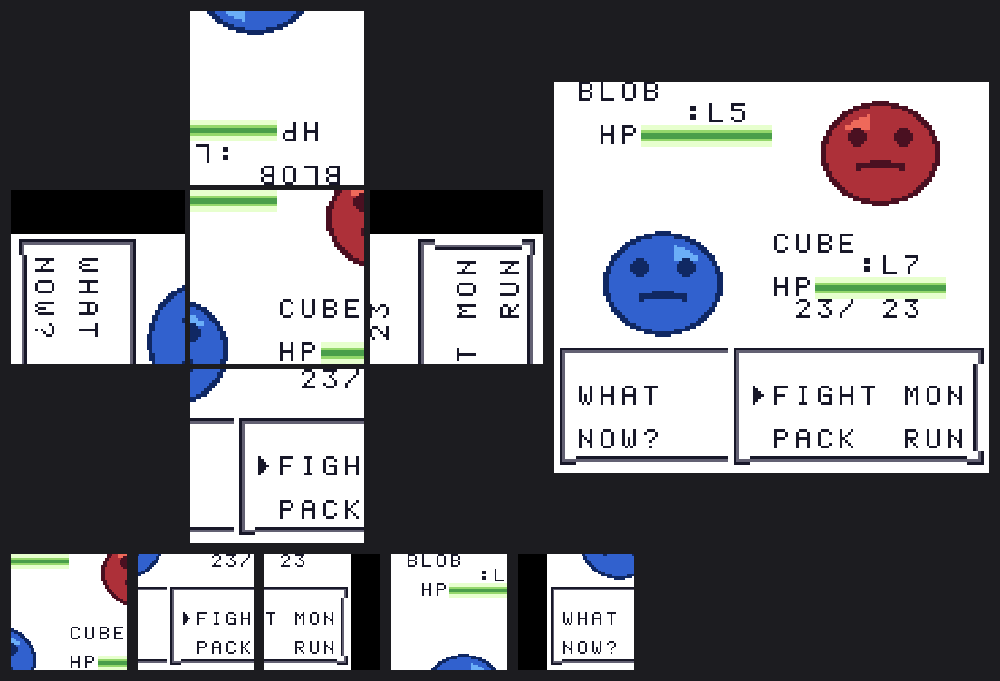 |
| **C: front face** (re-flowed text, world kept) | 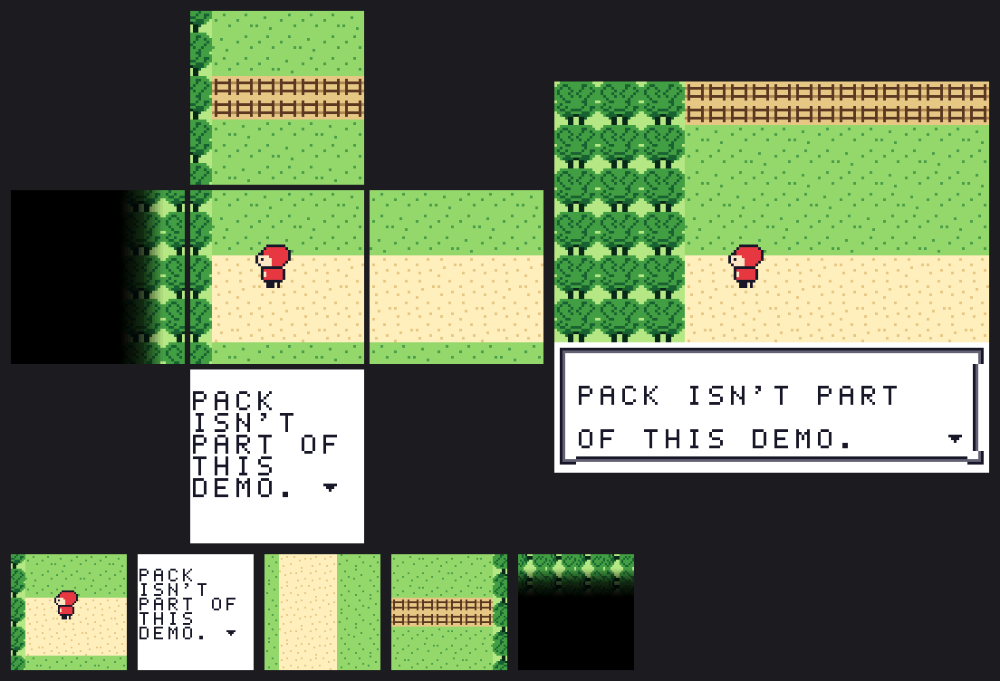 | 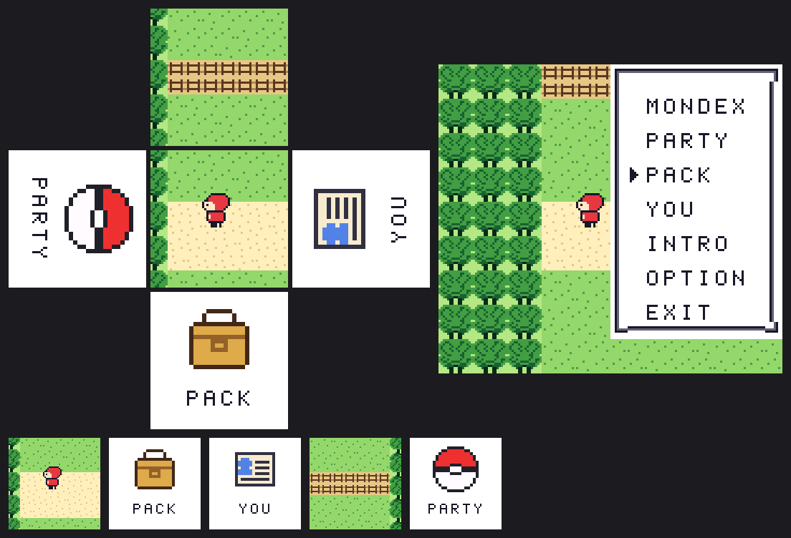 | 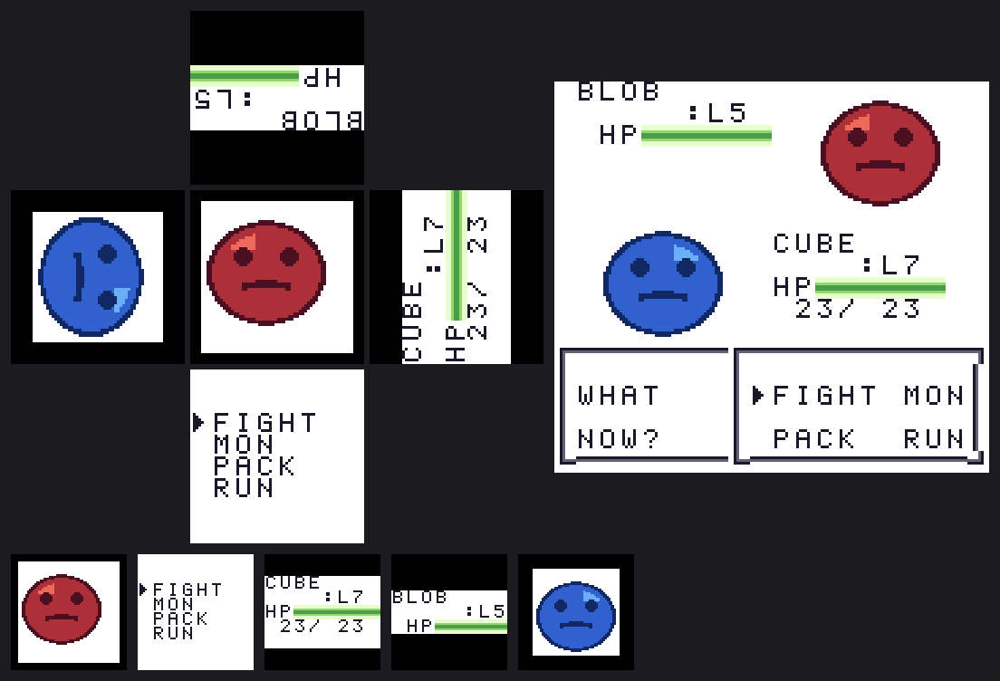 |

- **A** drapes the whole frame like Phase 2. It centres on the menu cursor,
  else the newest character typed, else the text, and eases there.
  - It works for any game: without RAM knowledge it follows whatever
    changed in the frame.
  - But a line of text is 144 px and a face is 64. The rest spills onto a
    side face, where it reads sideways or upside down for whoever is
    looking at that face.
- **B** wraps the frame's bottom 64 rows (where text boxes and battle menus
  live) round the west, front and east faces as one band.
  - It puts the middle of the frame on top and the top-left on the back.
  - It's readable only by turning the cube, and the up face often shows
    nothing useful.
- **C** keeps the world on the cube and moves the active box to the front
  (south) face.
  - It finds Crystal's boxes by their frame corners and picks the one with
    the ▶ cursor or the newest text.
  - Text is re-wrapped to 8 characters a line. Menus are split into items
    by columns that are blank in every row, which handles Crystal's
    single-blank cursor slots.
  - In battle: the opponent goes on top, the HP boxes on the back and east
    faces, your Pokémon on the west, the menu on the front. Crop positions
    come from where Crystal draws them.

**Recommendation: C**, with A for screens C doesn't understand.

- C keeps every word on one face at 1:1, upright for someone holding the
  cube like a Game Boy (front toward them). The map and the people stay
  visible while they talk.
- It's also the cheapest on the die: the overworld text panel comes from
  RAM and VRAM, so the emulator needn't draw its frame at all.
- Its weak spot is that the re-flow is heuristic. The start menu, the
  party and the Pokédex get carousels instead (below). Other full-screen
  screens are classified as "other": the ones with a framed box go to a
  still layout (below), and the rest (the bag, the Pokégear) get A, which
  follows the cursor.
- B isn't worth keeping.

#### The intro and the naming screen

Screens that aren't the map get two more C layouts (`core/src/screens.rs`):

- **Stills**: the new-game speech, the main menu, and any other screen with
  a framed box.
  - The frame is folded round the cube with the up face centred on the
    picture: whatever isn't backdrop outside the active box. Oak, the
    Pokémon and you are 7×7-tile pictures, so they fit a face at 1:1.
  - The box is blanked out of the fold and its text re-flowed onto the
    front, as in C.
  - Screens with no box (the opening movie, the title screen) are folded
    round the frame's centre and held still. A used to pan after whatever
    moved, so they swung about.
- **The naming screen** is recognised from `wTilemap`: ■ (`$60`) all
  round, "A B C…" or "a b c…" on row 8 (row 6 for a box name).
  - The prompt and the name so far go on the up face, centred, with the
    name scrolled to keep the next slot in view (Pokémon nicknames are 10).
  - The keyboard goes on the front. Crystal spaces its keys every other
    tile (17 tiles for 9 keys). Here they're packed at a 7 px pitch, which
    works because the font leaves its right-hand column blank. If any key
    doesn't, it falls back to 8 keys at 8 px, scrolled with the cursor.
    UPPER/lower, DEL and END get a line each.
  - The cursor is a sprite, not a tile, so the key under it comes from its
    sprite animation struct (`wNamingScreenCursorObjectPointer`: column in
    Var1, row in Var2). It's drawn inverted.
  - It's drawn from RAM and VRAM only, so the emulator needn't draw lines.

| | C | A: pan |
|---|---|---|
| New-game speech (demo) | 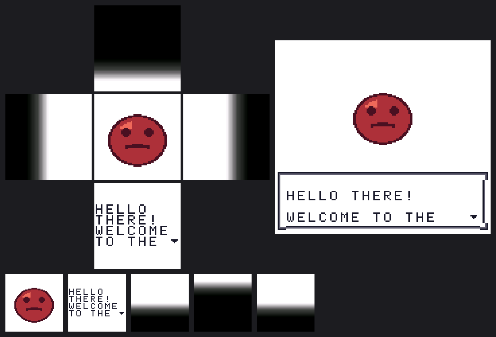 | 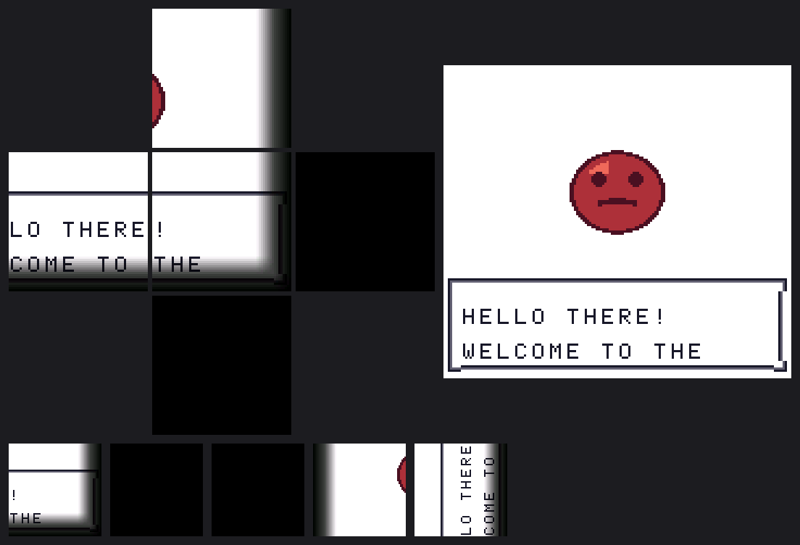 |
| Naming screen (demo) | 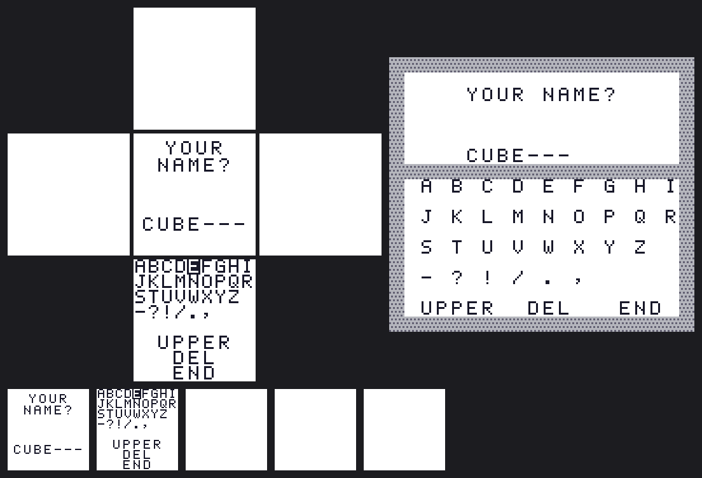 | 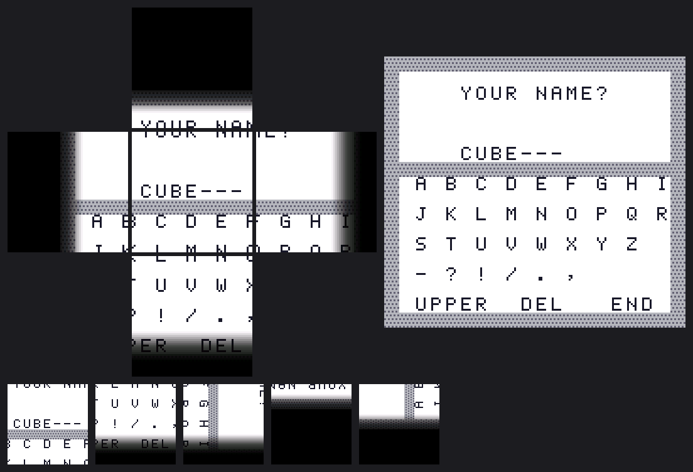 |

Both were built from the pret disassembly (`engine/menus/naming_screen.asm`,
`engine/menus/intro_menu.asm`) and checked on the demo cart's imitations.
They haven't been checked against the real ROM.

#### The start menu, the party and the Pokédex as carousels

`core/src/menus.rs`, like the die firmware's own menu: the selection on
the front face, the next one on the east face, the previous one on the
west. A new selection slides onto the front from the side it was on, over
8 frames.

The game still runs the menu. The selection is the game's cursor, and
tilting is the D-pad that moves it. A and B are the game's own, so
everything works as usual: choosing, the submenus, saving. The cube only
changes how the menu looks.

- **Start menu:** recognised by the open menu's items table
  (`wMenuDataPointerTableAddr` is `StartMenu.Items`).
  - Each item is a card. The icon is the cube's own pixel art, picked by
    the item's `STARTMENUITEM_*`. The label is copied from the screen, so
    your name is there for the status item.
  - The map stays on the up and back faces.
- **Party:** recognised by the nicknames where the party screen prints them.
  - The front face shows the selected Pokémon's card: name, level, status,
    an HP bar coloured like the game's, HP and types.
  - The up face shows its picture.
  - The side faces show its neighbours' pictures and names.
  - The back face lists the whole party, the selection inverted, with an HP
    colour pip each.
  - When the game's STATS/SWITCH submenu opens, the submenu takes the front
    face.
- **Pokédex list:** recognised by its divider tiles, while it's in
  `DEXSTATE_MAIN_SCR`. The selected species is `wPokedexOrder` at the
  scroll offset plus the cursor.
  - The front face shows the number, the name, owned or seen, and the
    types.
  - The up face shows the picture, or a "?" for one not seen yet.
  - The back face shows the seen and owned counts.

| | Start menu | Party | Pokédex |
|---|---|---|---|
| C | 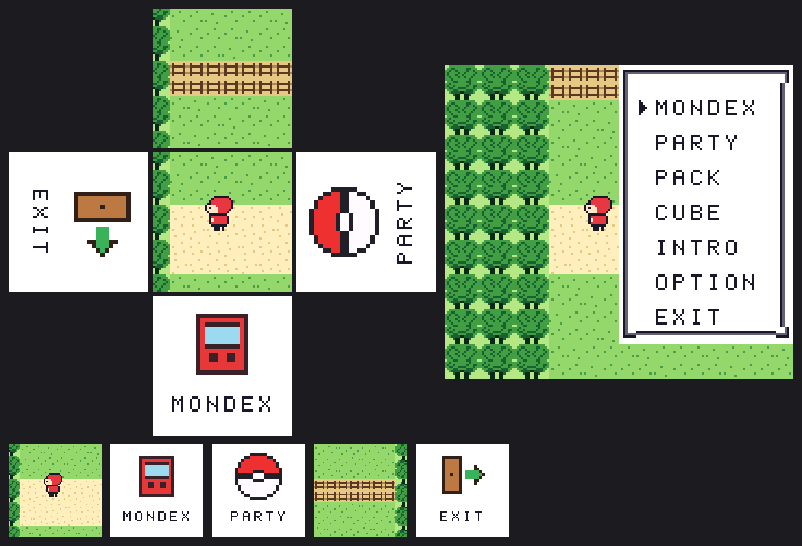 | 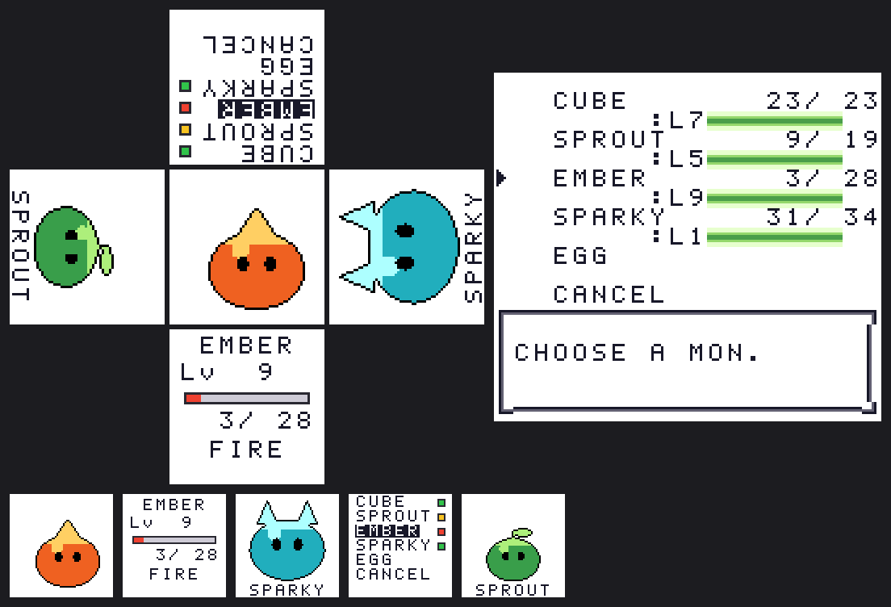 | 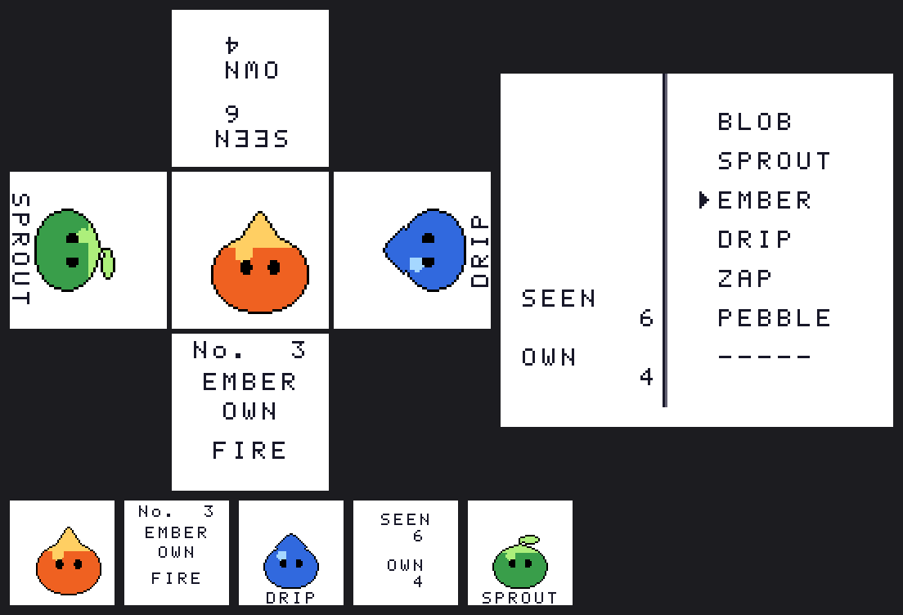 |
| | 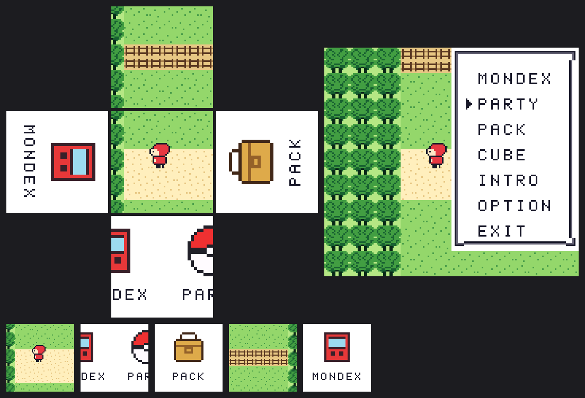 | 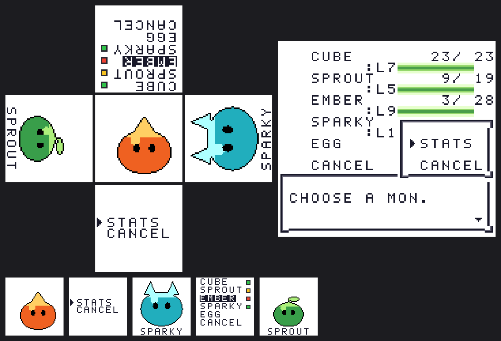 | 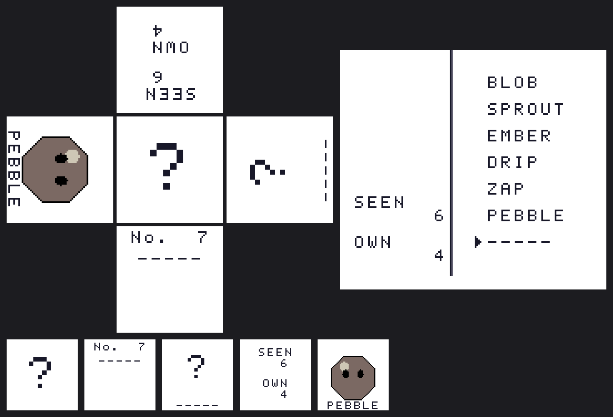 |
| A: pan, for comparison |  | 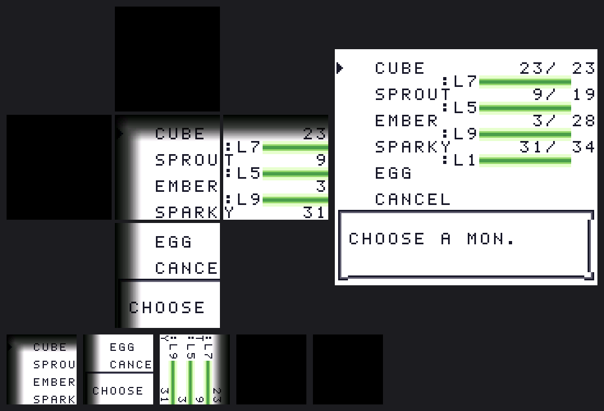 | 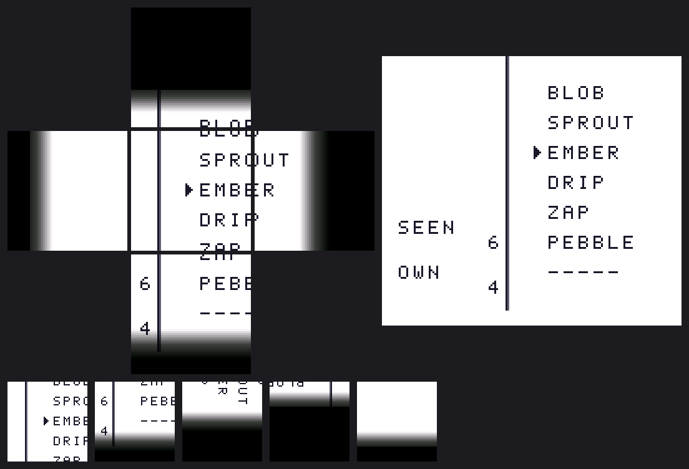 |

**Pictures** are the game's own, decompressed from the ROM by
`crystal/mons.rs`:

- `PokemonPicPointers` gives the bank and address, and `FixPicBank`'s table
  turns the stored bank into the real one.
- `BaseData` gives the size (5×5 to 7×7 tiles). The picture is placed in
  its 7×7 box the way `PadFrontpic` places it.
- The data is Crystal's LZ variant (`home/decompress.asm`, all seven
  commands). Only the first frame is decompressed; the animation frames
  after it are left alone.
- Colours come from `PokemonPalettes`: white, the two colours, black. Shiny
  ones use the shiny palette.
- Unown in the party gets its letter from its DVs.

Four pictures are cached (3 KB), so moving along the list decompresses
one. Names, types and the rest come from `PokemonNames`, `BaseData`,
`TypeNames`, the party structs and the Pokédex flags. All of it is drawn
from RAM, VRAM and ROM, so like the world these screens don't need the
emulator to draw its frame.

As with the intro, all of this follows the disassembly and is checked on
the demo cart's imitations (its own creatures, not Pokémon). It hasn't run
against the real ROM yet.

The browser view of C:

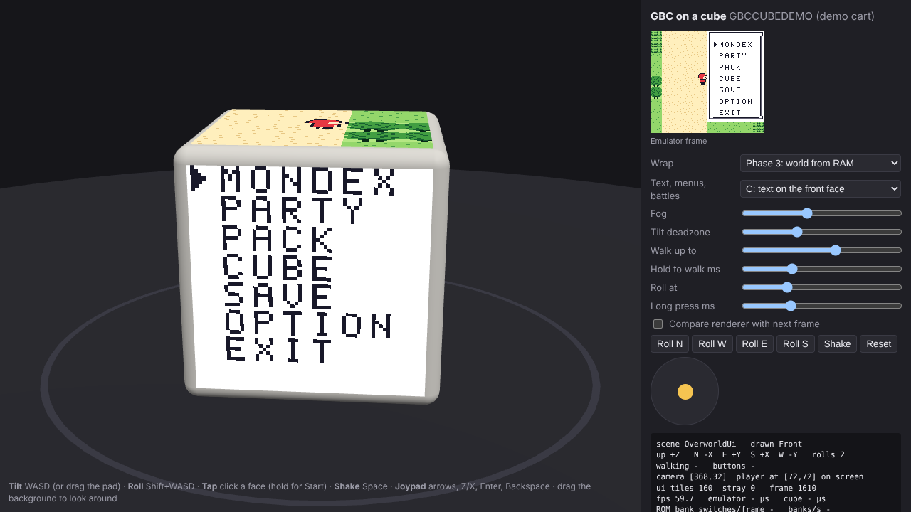
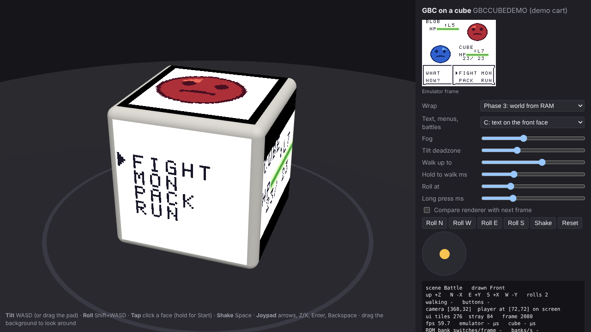

### Phase 5: controls

`core/src/controls.rs` (see the table above). Notes:

- **Tilt directions are map directions.** They're computed in the heading's
  frame, so "dip the north edge, walk north" holds on any face.
- **Gravity** uses the firmware's own filter (`smokebomb_core::orientation::Gravity`).
- **Rolling vs walking.** A roll passes through the walking range on its
  way over. So a tilt only walks once held for 120 ms and below 40°, and
  after a roll walking is locked out for 450 ms. A quick roll doesn't take
  a stray step.
- **Shake** counts three jolts over 1.9 g within 800 ms, then releases one
  Select.

## Without the ROM: the demo cart

This container had no Crystal ROM, and building one from the disassembly
would sidestep the "your own legally dumped ROM" rule. So `demo/` is a
stand-in, with original art:

- It builds a tiny cartridge in memory: an `ei; halt` loop, plus the
  metatiles, palette map and `Facings` tables in ROM.
- It then plays the game's part in Rust between frames: walking, NPCs, a
  text box, a start menu and a battle. INTRO in the start menu plays a
  professor's speech and then the naming screen.
- Its start menu's PARTY and MONDEX open a party screen and a Pokédex list
  laid out like Crystal's. Its six creatures have base data, names, type
  names, palettes and LZ-compressed pictures at Crystal's ROM addresses,
  which is why the cart is 2 MiB.
- It writes every bit of state at Crystal's addresses and in Crystal's
  formats. The emulator's real PPU draws the frames.

That's what the tests and screenshots run on. It proves the renderer
against a real PPU, the cube's geometry, the fallbacks and the controls.
**It can't prove that Crystal behaves the way the demo imitates it.**

To check against the real game:

1. Run `serve` with the ROM and tick "Compare renderer with next frame":
   - expect 0 px differing while walking, except on frames where water
     animates;
   - near map edges without connections the fog replaces the border block,
     so pixels there differ by design.
2. Watch the status line's `stray` count. A high count in the overworld
   means the camera or tile lookup is off.
3. Run `gbc-cube bench --rom` and `m33bench` with the ROM for the hardware
   numbers.

## The trickiest problems

1. **No ROM to test against.**
   - *Problem:* the renderer still had to be checkable without one.
   - *Fix:* the demo cart writes Crystal's RAM layout from Rust and lets the
     real PPU draw. The world renderer is then tested pixel for pixel
     against the next PPU frame.
2. **Which frame is the RAM describing?**
   - *Problem:* when `run_frame` returns, RAM is already the next frame's
     state while the frame on screen is the old one. Mixing the two
     jittered a step's first frame.
   - *Fix:* read everything prepared (`hSCX`, not `rSCX`; the shadow OAM,
     not OAM). Check `wVBlankOccurred` so a half-updated RAM is never
     drawn. Compare against frame N+1.
3. **Smooth step scrolling.**
   - *Problem:* Crystal moves its anchors a whole step at the start of a
     step and lets the scroll catch up.
   - *Fix:* the camera is the anchor plus the signed scroll-to-anchor
     distance in the 32×32 BG map, with wrap.
4. **Crystal's tile quirks.** Block numbers wrap at 128. Tile IDs lose bit 7
   in `wTilemap`. Each tile's palette and VRAM bank come from a nibble per
   *original* ID, read from a different ROM bank than the metatiles.
5. **8-bit object positions.**
   - *Problem:* an NPC 178 px to the right read as 78 px to the left.
   - *Fix:* use the map coordinates to choose the wrap, and mirror
     Crystal's object-struct window in the demo.
6. **Draping maths.**
   - *Problem:* each face has its own drawing axes and panel mount, and
     north has to survive any sequence of rolls.
   - *Fix:* everything is signed die axes and quarter turns, built from the
     firmware's face bases, and tested over all 24 orientations.
7. **Rolling vs walking.** A roll passes through the walking tilt range on
   its way over. A short hold time and an upper angle keep rolls from
   taking a step.
8. **Reading menus.**
   - *Problem:* Crystal separates menu columns with a single blank, the
     next item's cursor slot, so splitting on double spaces fails.
   - *Fix:* find boxes by their frame corners, and split at columns that
     are blank in every row.
9. **Fitting the M33.**
   - *Problem:* the first renderer cost 2.6 M instructions a frame, more
     than the emulator.
   - *Fix:* a table-driven 2bpp decode and an affine, bounds-hoisted drape
     brought it to 1.09 M. Switching the emulator's line drawing off while
     the world is drawn from RAM saves another 1 M.
10. **Measuring a Cortex-M33 without one.**
    - *Fix:* QEMU with `-icount shift=0` counts instructions as virtual
      nanoseconds.
    - *Problem:* SysTick's first reload after a clear raises no interrupt,
      which first gave negative times.
11. **Browser lag.**
    - *Problem:* pushing 140 KB frames at 60 fps to a slow page queued
      seconds of video, and the page's input and status sat behind it.
    - *Fix:* frames are now pulled, one at a time.
12. **Flashes while walking.**
    - *Problem:* walking a step or crossing into the next map can leave
      Crystal's RAM between two states for a frame (new blocks, old
      anchor). That reads as "not the map", and the faces flashed to the
      fallback for a frame.
    - *Fix:* the map is only dropped after 6 frames in a row (100 ms) say
      it's gone. Until then the last good canvas stays. A screen of
      nothing but font tiles (the naming screen) also has to have some
      map showing to count as the map.
13. **Knowing which menu is open.**
    - *Problem:* Crystal has no "current screen" variable. Much of the RAM
      the menus use is a union that other screens reuse.
    - *Fix:* each screen is recognised by something only it does: the start
      menu by its items table, the party screen by the party's nicknames
      where it prints them, the Pokédex by its divider tiles and jumptable
      state. Union RAM is believed only when it's in range.
14. **Vendored C.** walnut-cgb's header uses `struct gb_s` in prototypes
    before declaring it. It's fixed with a forward declaration in the shim,
    so the vendored file stays unmodified.
